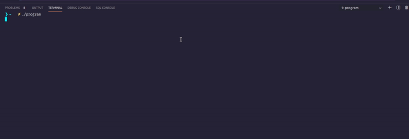

# Kybod :keyboard:

<br>
### Kybod is C library for listen keyPress from keyboard


# installation

Go to project lib directory
```bash
thanawit-udompol@thanawit-luxiaz:~{Your-Project-Lib}$ git clone <repository>
```
# platform can use for now

| Platform | Status |
|----------|--------|
| Window   |   ❌   | 
| Linux    |  :white_check_mark: |
| MacOS    |  ❌ |

# Header files 

```
keybot library structure
| Makefile
|
└─── include
|   | std.h
|   └─── platform
|       | platform.h 
|       | linux.
|
└─── src
    | linux.c
```

# [Licence](LICENSE)
## MIT License
